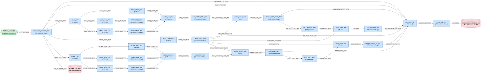

# CREW_J_TE_EMPLOYEE_PHONE_DW

```mermaid
flowchart LR

    %% Source stages
    WSTELE_LND_TDC(["WSTELE_LND_TDC\n(TeradataConnectorPX)"])

    %% Transformation stages
    ALL_REC_FNL["ALL_REC_FNL\n(PxFunnel)"]
    NULL_VAL_TFM["NULL_VAL_TFM\n(CTransformerStage)"]
    BASIC_TYPE_PVT["BASIC_TYPE_PVT\n(PxPivot)"]
    BASIC_REC_TFM["BASIC_REC_TFM\n(CTransformerStage)"]
    SEPARATE_PHTYPE_TFM["SEPARATE_PHTYPE_TFM\n(CTransformerStage)"]
    HOME_SEQ1_PVT["HOME_SEQ1_PVT\n(PxPivot)"]
    HOME_CPY["HOME_CPY\n(PxCopy)"]
    HOME_SEQ_FNL["HOME_SEQ_FNL\n(PxFunnel)"]
    INC_PRTY_TFM["INC_PRTY_TFM\n(CTransformerStage)"]
    HOME_BASIC_JNR["HOME_BASIC_JNR\n(PxJoin)"]
    NEW_PRTY_TFM["NEW_PRTY_TFM\n(CTransformerStage)"]
    HOME_SEQ2_TFM["HOME_SEQ2_TFM\n(CTransformerStage)"]
    HOME_SEQ3_TFM["HOME_SEQ3_TFM\n(CTransformerStage)"]
    MAX_PRTY_AGG["MAX_PRTY_AGG\n(PxAggregator)"]
    BASIC_MAX_JNR["BASIC_MAX_JNR\n(PxJoin)"]
    ADJUSTING_PRTY_TFM["ADJUSTING_PRTY_TFM\n(CTransformerStage)"]
    AWAY_MAX_JNR["AWAY_MAX_JNR\n(PxJoin)"]
    ADJUST_PRTY_TFM["ADJUST_PRTY_TFM\n(CTransformerStage)"]
    HOME_SEQ2_PVT["HOME_SEQ2_PVT\n(PxPivot)"]
    HOME_SEQ3_PVT["HOME_SEQ3_PVT\n(PxPivot)"]
    AWAY_SEQ3_TFM["AWAY_SEQ3_TFM\n(CTransformerStage)"]
    AWAY_SEQ2_TFM["AWAY_SEQ2_TFM\n(CTransformerStage)"]
    AWAY_SEQ_FNL["AWAY_SEQ_FNL\n(PxFunnel)"]
    AWAY_SEQ3_PVT["AWAY_SEQ3_PVT\n(PxPivot)"]
    AWAY_SEQ2_PVT["AWAY_SEQ2_PVT\n(PxPivot)"]
    AWAY_CPY["AWAY_CPY\n(PxCopy)"]
    AWAY_SEQ1_PVT["AWAY_SEQ1_PVT\n(PxPivot)"]
    INC_AWAY_PRTY_TFM["INC_AWAY_PRTY_TFM\n(CTransformerStage)"]
    AWAY_BASIC_JNR["AWAY_BASIC_JNR\n(PxJoin)"]
    MAX_ABPRTY_AGG["MAX_ABPRTY_AGG\n(PxAggregator)"]
    ABREC_NEW_PRTY_TFM["ABREC_NEW_PRTY_TFM\n(CTransformerStage)"]

    %% Target stages
    TE_EMPLOYEE_PHONE_DW[("TE_EMPLOYEE_PHONE_DW\n(TeradataConnectorPX)")]
    WSSEN_ERR_SEQ[("WSSEN_ERR_SEQ\n(PxSequentialFile)")]

    %% Edges
    ABREC_NEW_PRTY_TFM -->|"ABNEW_PRTY_OUT_TFM"| ALL_REC_FNL
    ABREC_NEW_PRTY_TFM -->|"ABCPRTY_OUT_TFM"| MAX_ABPRTY_AGG
    ADJUSTING_PRTY_TFM -->|"ADJ_PRTY_OUT_TFM"| ALL_REC_FNL
    ADJUST_PRTY_TFM -->|"ADJUST_PRTY_OUT_TFM"| ALL_REC_FNL
    ALL_REC_FNL -->|"ALL_REC_OUT_FNL"| NULL_VAL_TFM
    AWAY_BASIC_JNR -->|"ABREC_OUT_JNR"| ABREC_NEW_PRTY_TFM
    AWAY_CPY -->|"AWAY_SEQ1_CPY"| AWAY_SEQ1_PVT
    AWAY_CPY -->|"AWAY_SEQ2_CPY"| AWAY_SEQ2_PVT
    AWAY_CPY -->|"AWAY_SEQ3_CPY"| AWAY_SEQ3_PVT
    AWAY_MAX_JNR -->|"DSLink85"| ADJUST_PRTY_TFM
    AWAY_SEQ1_PVT -->|"ASEQ1_OUT_PVT"| AWAY_SEQ_FNL
    AWAY_SEQ2_PVT -->|"ASEQ2_OUT_PVT"| AWAY_SEQ2_TFM
    AWAY_SEQ2_TFM -->|"ASEQ2_OUT_TFM"| AWAY_SEQ_FNL
    AWAY_SEQ3_PVT -->|"ASEQ3_OUT_PVT"| AWAY_SEQ3_TFM
    AWAY_SEQ3_TFM -->|"ASEQ3_OUT_TFM"| AWAY_SEQ_FNL
    AWAY_SEQ_FNL -->|"ASEQ_OUT_FNL"| INC_AWAY_PRTY_TFM
    BASIC_MAX_JNR -->|"BMAX_OUT_JNR"| ADJUSTING_PRTY_TFM
    BASIC_REC_TFM -->|"ALL_BREC_OUT_TFM"| ALL_REC_FNL
    BASIC_REC_TFM -->|"CALL_PRI_RIGHT_JNR"| AWAY_BASIC_JNR
    BASIC_REC_TFM -->|"BASIC_REC_OUT_TFM"| AWAY_MAX_JNR
    BASIC_REC_TFM -->|"BREC_OUT_TFM"| BASIC_MAX_JNR
    BASIC_REC_TFM -->|"CALL_PRIORITY_RIGHT_JNR"| HOME_BASIC_JNR
    BASIC_TYPE_PVT -->|"BREC_OUT_PVT"| BASIC_REC_TFM
    HOME_BASIC_JNR -->|"HBREC_OUT_JNR"| NEW_PRTY_TFM
    HOME_CPY -->|"HOME_SEQ1_CPY"| HOME_SEQ1_PVT
    HOME_CPY -->|"HOME_SEQ2_CPY"| HOME_SEQ2_PVT
    HOME_CPY -->|"HOME_SEQ3_CPY"| HOME_SEQ3_PVT
    HOME_SEQ1_PVT -->|"HSEQ1_OUT_PVT"| HOME_SEQ_FNL
    HOME_SEQ2_PVT -->|"HSEQ2_OUT_PVT"| HOME_SEQ2_TFM
    HOME_SEQ2_TFM -->|"HSEQ2_OUT_TFM"| HOME_SEQ_FNL
    HOME_SEQ3_PVT -->|"HSEQ3_OUT_PVT"| HOME_SEQ3_TFM
    HOME_SEQ3_TFM -->|"HSEQ3_OUT_TFM"| HOME_SEQ_FNL
    HOME_SEQ_FNL -->|"HSEQ_OUT_FNL"| INC_PRTY_TFM
    INC_AWAY_PRTY_TFM -->|"CALL_PRIORITY_LEFT_JNR"| AWAY_BASIC_JNR
    INC_PRTY_TFM -->|"CALL_PRIORITY_LEFT_JNR"| HOME_BASIC_JNR
    MAX_ABPRTY_AGG -->|"AMAX_OUT_AGG"| AWAY_MAX_JNR
    MAX_PRTY_AGG -->|"HMAX_OUT_AGG"| BASIC_MAX_JNR
    NEW_PRTY_TFM -->|"NPRTY_OUT_TFM"| ALL_REC_FNL
    NEW_PRTY_TFM -->|"CPRTY_OUT_TFM"| MAX_PRTY_AGG
    NULL_VAL_TFM -->|"LNK_IN_DW"| TE_EMPLOYEE_PHONE_DW
    SEPARATE_PHTYPE_TFM -->|"EMERGENCY_IN_TFM"| ALL_REC_FNL
    SEPARATE_PHTYPE_TFM -->|"TEMP_TYPE_TFM"| ALL_REC_FNL
    SEPARATE_PHTYPE_TFM -->|"AWAY_TYPE_CPY"| AWAY_CPY
    SEPARATE_PHTYPE_TFM -->|"BASIC_TYPE_TFM"| BASIC_TYPE_PVT
    SEPARATE_PHTYPE_TFM -->|"HOME_TYPE_CPY"| HOME_CPY
    SEPARATE_PHTYPE_TFM -->|"LNK_OUT_ERR_SEQ"| WSSEN_ERR_SEQ
    WSTELE_LND_TDC -->|"LNK_OUT_TDC"| SEPARATE_PHTYPE_TFM

    %% Style
    classDef source fill:#d4edda,stroke:#28a745,color:#000,font-weight:bold
    classDef target fill:#f8d7da,stroke:#dc3545,color:#000,font-weight:bold
    classDef xform fill:#cce5ff,stroke:#004085,color:#000

    class WSTELE_LND_TDC source
    class TE_EMPLOYEE_PHONE_DW,WSSEN_ERR_SEQ target
    class ALL_REC_FNL,NULL_VAL_TFM,BASIC_TYPE_PVT,BASIC_REC_TFM,SEPARATE_PHTYPE_TFM,HOME_SEQ1_PVT,HOME_CPY,HOME_SEQ_FNL,INC_PRTY_TFM,HOME_BASIC_JNR,NEW_PRTY_TFM,HOME_SEQ2_TFM,HOME_SEQ3_TFM,MAX_PRTY_AGG,BASIC_MAX_JNR,ADJUSTING_PRTY_TFM,AWAY_MAX_JNR,ADJUST_PRTY_TFM,HOME_SEQ2_PVT,HOME_SEQ3_PVT,AWAY_SEQ3_TFM,AWAY_SEQ2_TFM,AWAY_SEQ_FNL,AWAY_SEQ3_PVT,AWAY_SEQ2_PVT,AWAY_CPY,AWAY_SEQ1_PVT,INC_AWAY_PRTY_TFM,AWAY_BASIC_JNR,MAX_ABPRTY_AGG,ABREC_NEW_PRTY_TFM xform
```
