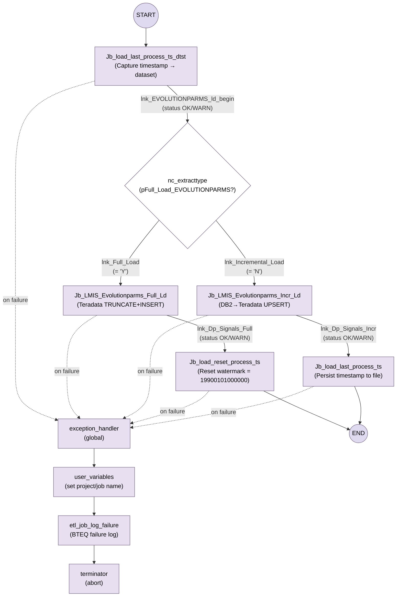
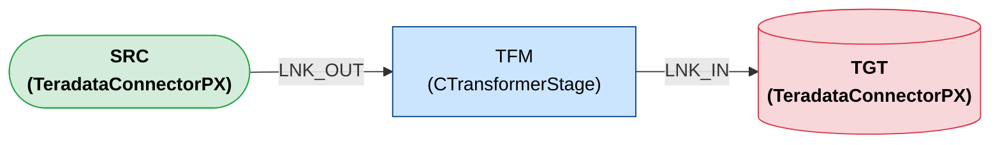

# Step 1: DataStage XML → Lineage Excel Workbook + Mermaid Diagram

## Multi-Job Awareness

First read `output/discovery.json` (generated by Step 0). It tells you:
- Which parallel jobs to process (`execution_plan.jobs_to_process`)
- Whether there is a sequence orchestration to handle

**You must generate a separate lineage Excel + Mermaid for EACH parallel job listed
in `jobs_to_process`.** Each job is a separate `<Job>` element inside the same XML file.
Filter to the correct `<Job>` by matching `Job.Identifier` to the job name.

Output files per job:
- `output/{job_name}_lineage.xlsx`
- `output/{job_name}_lineage_diagram.md`

If there is a sequence job (`orchestration.sequence_job_name` is not null), also generate:
- `output/{seq_job_name}_orchestration.md` — a Mermaid flowchart diagram showing the
  full sequence execution graph: activities, conditional branching, failure paths,
  exception handling, and termination. This is a TOP-DOWN flowchart, not left-to-right.

### Sequence Orchestration Diagram Format

The sequence diagram uses DIFFERENT rules from the parallel job lineage diagram.
A sequence diagram shows orchestration flow (job activities, conditions, error paths),
not data lineage (sources, transforms, targets). Follow this format EXACTLY:

**Layout:** Always `flowchart TB` (top to bottom) — NOT `flowchart LR`.

**Node shapes — determined by activity type:**
- START node: circle `((START))`
- END node: circle `((END))`
- JSJobActivity: rectangle `["activity_name\n(description)"]`
- JSCondition: diamond `{"condition_name\n(parameter?)"}`
- JSExceptionHandler: rectangle `["exception_handler\n(global)"]`
- JSUserVarsActivity: rectangle `["user_variables\n(description)"]`
- JSExecCmdActivity: rectangle `["cmd_activity\n(description)"]`
- JSTerminatorActivity: rectangle `["terminator\n(abort)"]`

**Diamonds ARE allowed in sequence diagrams** — they represent condition nodes.
(The "no diamonds" rule applies only to parallel job lineage diagrams.)

**Edge styles:**
- Normal flow (success/OK/WARN): solid arrow with link name and condition
  `A -->|"lnk_name\n(condition)"| B`
- Failure path: dotted arrow with "on failure" label
  `A -.->|"on failure"| B`

**Descriptive subtitles:** Every node should have a subtitle in parentheses
describing what it does, extracted from the XML properties:
- Job activities: source→target type (e.g., "Teradata TRUNCATE+INSERT", "DB2→Teradata UPSERT")
- Condition nodes: the parameter being checked (e.g., "pFull_Load_EVOLUTIONPARMS?")
- Timestamp jobs: what they do (e.g., "Capture timestamp → dataset", "Reset watermark")
- Exception handler: "(global)" to indicate it catches all failures
- Exec commands: what they run (e.g., "BTEQ failure log")

**Colors:**
```
classDef activity fill:#e8e0f0,stroke:#6c5b7b,color:#000
classDef condition fill:#fff,stroke:#6c5b7b,color:#000
classDef error fill:#e8e0f0,stroke:#6c5b7b,color:#000
classDef terminal fill:#e8e0f0,stroke:#6c5b7b,color:#000
classDef startend fill:#e0daf0,stroke:#6c5b7b,color:#000
```

**Failure paths:** Every JSJobActivity node that has an exception handler
connection should have a dotted arrow to the exception_handler node:
`ACTIVITY -.->|"on failure"| EXC`

**Exception chain:** Show the full exception handling path:
`exception_handler → user_variables → etl_job_log_failure → terminator`

**Concrete example** (matching the DataStage Designer sequence view):



**CRITICAL rules for sequence diagrams:**
- Extract activity descriptions from the XML (source/target DB types, load strategy)
- Extract condition expressions VERBATIM from the XML
- Show ALL failure paths as dotted arrows to the exception handler
- Every JSJobActivity that can fail must have a failure path shown
- The exception handling chain must be complete: handler → vars → log → terminate
- Use commas in class assignments: `class A,B,C styleName` (NOT spaces)

## Single Job Shortcut

If `discovery.json` shows `scenario: "single_parallel_job"`, process just that one job.
The output is identical to processing one job from a multi-job XML.

---

## Detailed Requirements

You are an expert in IBM DataStage, ETL lineage, source-to-target mapping, and Python automation.

**Input:**
- The ONLY input is the DataStage XML export file in the `input/` folder.
- Do not assume any Excel, metadata file, data model file, or external mapping file exists.
- All outputs must be derived only from the DataStage XML content.

**Objective:**
Write Python code that parses the DataStage XML and generates a single Excel workbook
containing 3 tabs, plus a standalone Mermaid `.md` file.

---

### TAB 1: Stage_Sequence

Create a stage-level inventory of the DataStage job flow in execution order.

Requirements:
- Parse all stages, links, connectors, and properties from the XML.
- Identify stage category as Source, Transformation, or Target.
- Reconstruct the job graph and determine logical execution flow.
- Assign sequence numbers based on flow structure:
  - Sequential stages: 1, 2, 3, 4...
  - Parallel stages: 3A, 3B, 3C...
  - After merge, continue with the next main sequence number.
- Include one row per stage with these columns:
  - Sequence_No
  - Stage_Name
  - Stage_Type
  - Stage_Category
  - Input_Stages
  - Output_Stages
  - Parallel_Group
  - Stage_Description
  - Link_Names_In
  - Link_Names_Out
  - Transformation_Summary

Rules for Transformation_Summary:
- Summarize the purpose of the stage based on stage type and XML properties.
- Examples: filter, join, sort, lookup, aggregate, copy, remove duplicates, transformer, funnel, merge, column derivation, passthrough, file read, file write, table load, etc.
- If exact logic is unclear from XML, write "Needs manual validation".

---

### TAB 2: Mermaid_Lineage

Generate a Mermaid flowchart representing the DataStage lineage visually, matching the
DataStage Designer canvas appearance.

Requirements:
- Show sources on the left and targets on the right.
- Show sequential and parallel paths clearly.
- Represent each stage as a node with proper shape based on its Stage_Category.
- Show all links as labeled edges.
- Include a plain-English lineage summary after the Mermaid code in this tab.

**Mermaid format — follow this EXACTLY. No deviations:**

**Layout:** Always `flowchart LR` (left to right).

**Node shapes — determined by Stage_Category:**
- Source stages: stadium shape `(["STAGE_NAME\n(StageType)"])`
- Target stages: cylinder shape `[("STAGE_NAME\n(StageType)")]`
- Transformation stages: rectangle `["STAGE_NAME\n(StageType)"]`

**NEVER use diamond `{"..."}`, hexagon `{{"..."}}`, or any other shape in parallel job lineage diagrams.**
(Diamonds ARE used in sequence orchestration diagrams — see the orchestration section above.)

**Node labels:** Always two lines — stage name on line 1, stage type in parentheses on line 2.
Use `\n` for the line break. Example: `MY_STAGE["MY_STAGE\n(PxJoin)"]`

**Edges:** Use the link name as label: `STAGE_A -->|"LINK_NAME"| STAGE_B`

**Colors — use these EXACT classDef values:**
```
classDef source fill:#d4edda,stroke:#28a745,color:#000,font-weight:bold
classDef target fill:#f8d7da,stroke:#dc3545,color:#000,font-weight:bold
classDef xform fill:#cce5ff,stroke:#004085,color:#000
```

**Class assignment:** Assign every source stage to `source`, every target stage to `target`,
every transformation stage to `xform`.

**Structure order:** First all node declarations, then all edges, then classDef/class lines.

**Concrete example** (3 stages: 1 source, 1 transform, 1 target):


**CRITICAL: Every edge from the XML must appear. Every stage must appear as a node.**

---

### TAB 3: Source_to_Target_Mapping

Create an **end-to-end** source-to-target column mapping derived from the DataStage XML.

#### THE MOST IMPORTANT RULE FOR THIS TAB:

**The `Target_Stage` column must ONLY contain actual target stages — stages that have
NO output links (Stage_Category = Target). These are the final destination stages
where data is written (database tables, files, etc.).**

**Do NOT list intermediate transformation stages as targets. Do NOT create a row per
intermediate stage. Each row traces one target column all the way back to the original
source, with all intermediate derivation logic aggregated into a single expression.**

This means:
- If the job writes to 1 target table and 1 error file → only those 2 stage names
  ever appear in the `Target_Stage` column.
- If the job writes to 3 target tables → only those 3 appear.
- NEVER: a CTransformerStage, PxJoin, PxFunnel, PxAggregator, or any intermediate
  stage appearing in the `Target_Stage` column.

#### How to build each row:

For each column on each TARGET stage's input link(s):
1. Start at the target column.
2. Walk backward through the DAG, following the link and stage chain.
3. At each CTransformerStage, check if this column has a Derivation expression.
   - If yes, record that expression as the Derivation_Logic.
   - If no (pass-through), keep walking backward.
4. At PxJoin stages, record the join keys and datasets in Join_Logic.
5. At PxAggregator stages, record the aggregation in Aggregation_Logic.
6. At PxPivot stages, note in Remarks that the column is pivot-expanded.
7. Continue until you reach the original SOURCE stage.
8. Record the original source table and source column name.

#### Columns for this tab:

- **Target_Stage** — ONLY actual target stages (Stage_Category = Target)
- **Target_Table_or_File** — the target table/file name
- **Target_Column** — column name at the target
- **Source_Stage** — the immediate upstream stage that provides the column value
- **Source_Table_or_File** — the original source table/file at the beginning of the pipeline
- **Source_Column** — the original source column name (before any transformations)
- **Stage_Path** — direct path: `Source_Table -> Last_Transform -> Target_Stage`
- **Source_to_Target_Path** — full end-to-end path through all intermediate stages
- **Derivation_Logic** — the verbatim derivation expression from XML. For pass-through columns,
  show the column reference (e.g., `LINK_NAME.COLUMN_NAME`). For derived columns, copy the
  exact DataStage expression.
- **Transformation_Types** — e.g., "Pass-through", "Conditional, String function", "Null handling"
- **Join_Logic** — if upstream joins affect this column, describe the join condition and datasets
- **Filter_Logic** — if any stage filters records for this column, show the filter expression
- **Lookup_Logic** — if lookups contribute to this column
- **Aggregation_Logic** — if aggregations affect this column (e.g., "MAX(CALL_PRTY) by EMP_NBR")
- **Default_or_Constant_Logic** — if column is a constant (e.g., "System: CurrentTimestamp()")
- **Mapping_Type** — "Pass-through" | "Derived" | "Constant"
- **Remarks** — additional context (e.g., "Pivot-expanded column", "Priority recalculated")

#### Rules:

- Pass-through: column flows from source to target with no expression changes
- Derived: column uses derivation expressions — copy them VERBATIM from the XML
- Constant: column is computed from functions/constants (CurrentTimestamp, hardcoded values)
- If source column tracing is uncertain → mark "Needs manual validation" in Remarks
- Do NOT guess — if derivation cannot be determined from XML, say so

#### Correct example (2 targets: an error file and a table):

| Target_Stage | Target_Table | Target_Column | Source_Column | Derivation_Logic | Mapping_Type |
|---|---|---|---|---|---|
| ERR_SEQ | ERR_FILE | EMP_NBR | TELE_EMP_NBR | LNK_OUT.EMP_NBR | Pass-through |
| ERR_SEQ | ERR_FILE | USER_ID | TELE_LAST_UPDATED_BY | LNK_OUT.USER_ID | Pass-through |
| TGT_DW | TGT_TABLE | EMP_NO | TELE_EMP_NBR | If Len(Trim(EMP_NBR))=9 Then ... | Derived |
| TGT_DW | TGT_TABLE | PH_NBR | PH_NBR | ALL_REC_OUT.PH_NBR | Pass-through |
| TGT_DW | TGT_TABLE | TD_LD_TS | (none) | CurrentTimestamp() | Constant |

**Notice: ONLY ERR_SEQ and TGT_DW appear as Target_Stage — NEVER intermediate stages.**

#### WRONG example (do NOT do this):

| Target_Stage | Target_Column | ... |
|---|---|---|
| TRANSFORM_1 | COL_A | ... |  ← WRONG: intermediate stage as target
| JOIN_STAGE | COL_B | ... |   ← WRONG: intermediate stage as target
| TGT_TABLE | COL_A | ... |

---

## Standalone Mermaid File

After writing the Excel, save the Mermaid diagram as:
`output/{job_name}_lineage_diagram.md`

This file must contain ONLY:
1. A `# JOB_NAME` heading
2. The Mermaid code block

**Nothing else. No "Job Lineage Summary". No timestamps. No "Generated by" footers.**

The lineage file should look exactly like:

```
# MY_JOB_NAME

```mermaid
flowchart LR

    ... (nodes)
    ... (edges)
    ... (classDef and class)
```
```

The orchestration file should look exactly like:

```
# MY_SEQUENCE_NAME — Orchestration

```mermaid
flowchart TB

    ... (START, activities, conditions, exception handling, END)
    ... (solid arrows for success, dotted arrows for failure)
    ... (classDef and class)
```
```

---

## Technical Instructions

- First inspect and summarize the XML structure before generating the final workbook.
- Reconstruct the job as a directed graph of stages and links.
- Detect source nodes (no input links), target nodes (no output links).
- Infer stage sequencing from graph topology (topological sort).
- Infer transformation meaning from: stage type, properties, link metadata,
  derivation expressions, constraint/filter expressions, column definitions.
- Use Python with `pandas` and `openpyxl`.
- Write modular, readable code with comments and error handling.
- Apply Excel formatting: bold headers, wrapped text, autofilter, freeze top row, sensible column widths.

## Execution Approach

Before writing the full code, first print:
1. XML structure summary
2. List of stage types found
3. Number of stages and links
4. Proposed sequencing approach
5. Any limitations in deriving column-level lineage from this XML

Then generate and execute the final code.

## Output Files

1. `output/{job_name}_lineage.xlsx` — 3-tab workbook (per parallel job)
2. `output/{job_name}_lineage_diagram.md` — Mermaid lineage diagram: `flowchart LR` (per parallel job)
3. `output/{seq_job_name}_orchestration.md` — Mermaid sequence diagram: `flowchart TB` (if sequence job exists)
